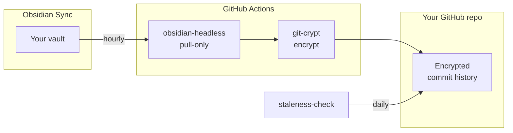

# obsidian-vault-backup-template

Encrypted, versioned backups of your Obsidian vault — powered by GitHub Actions.

<!-- TODO: Add hero image here -->

## Quick start

1. Click **[Use this template](../../generate)** to create a private repo.
2. Run `/setup` in [Claude Code](https://claude.ai/claude-code) for guided configuration — or follow [`.claude/commands/setup.md`](.claude/commands/setup.md) manually.
3. The hourly sync starts automatically.

## Why this exists

Obsidian Sync keeps your notes in sync across devices. But it doesn't give you version history, a backup you control, or a way to recover a note you deleted three months ago.

This template fixes that. Every hour, it pulls your vault from Obsidian Sync, encrypts it with git-crypt, and commits the snapshot to GitHub. You get full git history of every change to every note — encrypted at rest, on infrastructure you own.

## What you get

- **Hourly snapshots** of your entire vault, committed automatically
- **Full git history** — diff any note at any point in time
- **Encrypted at rest** via git-crypt (even in a private repo, notes deserve encryption)
- **Staleness alerts** — daily health check opens a GitHub Issue if sync hasn't run in 48 hours
- **Pull-only** — the backup never writes to your vault, so it can't corrupt your notes

## Cost

| Component | Cost |
|-----------|------|
| Obsidian Sync (Standard) | $4/mo |
| GitHub Actions | Free (well within the free tier) |
| GitHub private repo | Free |

## How it works

Two GitHub Actions workflows handle everything:

**Hourly sync** (`sync.yml`): Authenticates with Obsidian Sync (auth token, or password+TOTP fallback), unlocks git-crypt, pulls the vault via [obsidian-headless](https://github.com/obsidianmd/obsidian-headless), and commits any changes.

**Daily health check** (`staleness-check.yml`): Verifies the last successful sync happened within 48 hours and the repo stays under 50MB. Errors trigger GitHub notifications.

## Design decisions

- **GitHub Actions, not a VPS.** No infrastructure to maintain. Runs on the free tier.
- **git-crypt for encryption.** Transparent encrypt-on-commit, decrypt-on-checkout. Your notes stay encrypted on GitHub's servers.
- **Token-first auth with TOTP fallback.** Self-healing — no manual intervention when tokens expire.
- **Pull-only mode.** The headless client never pushes to Obsidian Sync, so it can't overwrite your notes with stale data.
- **Notes only, no plugins.** Plugin files add noise without meaningful version history value.

<!-- TODO: Add screenshots
- Commit history showing vault snapshots
- Staleness-check GitHub Issue
-->

## Prerequisites

- [Obsidian Sync](https://obsidian.md/sync) subscription (Standard at $4/mo or Plus)
- GitHub account
- [`git-crypt`](https://github.com/AGWA/git-crypt) installed locally
- [`gh`](https://cli.github.com) CLI installed locally

## Contributing

See [CONTRIBUTING.md](CONTRIBUTING.md) for architecture details, the three-repo development model, and how to test changes.

## License

[MIT](LICENSE)
